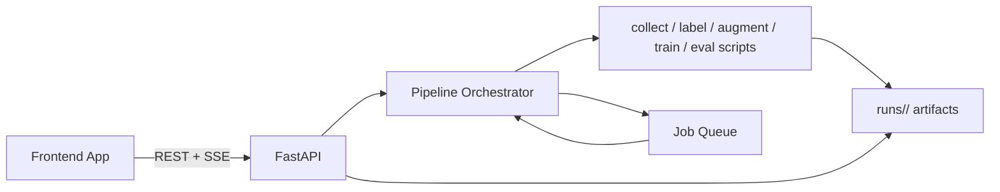

# fastapi api design for separate frontend

this document defines a simple api contract for building a separate frontend against Phase1&2.

## implementation status

the api is now implemented in `api/main.py` and reuses the existing skill scripts.

run it with:

```bash
uv sync
uv run uvicorn api.main:app --host 0.0.0.0 --port 8000 --reload
```

open docs at: `http://localhost:8000/docs`

## architecture



## core endpoints

- `POST /api/projects`
  - create or update a project config
  - body: `project`, `video_url`, `classes`, `label_mode`, `model`, `target_accuracy`, `num_agents`
- `GET /api/projects/{project}`
  - return effective config + derived output paths
- `POST /api/projects/{project}/run`
  - start a job: full pipeline or phase (`collect|label|augment|train|eval`)
- `GET /api/projects/{project}/jobs/{job_id}`
  - job state, started_at, finished_at, error, phase
- `GET /api/projects/{project}/status`
  - high-level phase + percentage + latest metrics summary
- `GET /api/projects/{project}/metrics`
  - contents of `runs/<project>/eval_results.json` if present
- `GET /api/projects/{project}/artifacts`
  - list generated artifacts (`frames`, `classes.txt`, `weights/best.pt`, previews)
- `GET /api/projects/{project}/events`
  - SSE stream for job logs and status updates

## minimal request examples

`POST /api/projects`

```json
{
  "project": "fruit-ninja-yt-sXfdfLHp9Ko",
  "video_url": "https://www.youtube.com/watch?v=sXfdfLHp9Ko",
  "classes": ["fruit", "bomb", "blade_trail"],
  "label_mode": "gemini",
  "model": "gemini-2.5-flash",
  "target_accuracy": 0.75,
  "num_agents": 4
}
```

`POST /api/projects/{project}/run`

```json
{
  "mode": "full"
}
```

poll status:

```bash
curl http://localhost:8000/api/projects/fruit-ninja-yt-sXfdfLHp9Ko/status
```

stream logs (SSE):

```bash
curl -N "http://localhost:8000/api/projects/fruit-ninja-yt-sXfdfLHp9Ko/events"
```

## execution strategy

- map each phase to subprocess calls using `uv run`:
  - collect: `.agents/skills/collect/scripts/run.py`
  - label: `.agents/skills/label/scripts/run.py` or `dispatch.sh` when `num_agents > 1`
  - augment: `.agents/skills/augment/scripts/run.py`
  - train: `.agents/skills/train/scripts/run.py`
  - eval: `.agents/skills/eval/scripts/run.py`
- emit progress events from subprocess stdout/stderr to SSE clients
- serialize training jobs per project to avoid weight file races
- store canonical artifacts only under `runs/<project>/`

## frontend integration notes

- treat `/status` as the source of truth for current state
- subscribe to `/events` for responsive log/progress UX
- call `/metrics` after eval completes to render charts
- use `/artifacts` to show downloadable model files and previews

## endpoint behavior details

- project configs are stored under `runs/_configs/<project>.json`
- when a run starts, the project config is synced to root `config.json` so existing scripts keep working
- only one active job per project is allowed at a time
- `mode=full` runs phases in order: `collect -> label -> augment -> train -> eval`
