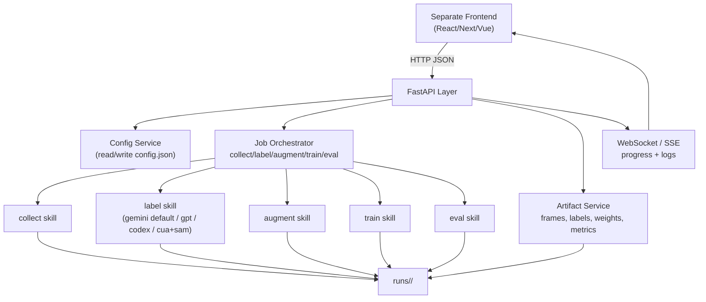

# Phase1&2 architecture

## what it does

takes a youtube gameplay url and autonomously produces a trained yolo model through an iterative loop: collect frames, label with vision llm, augment, train, evaluate, repeat until target accuracy.

## pipeline stages

```
youtube url + target classes
       |
       v
  +---------+     +-------+     +---------+     +-------+     +------+
  | collect | --> | label | --> | augment | --> | train | --> | eval |
  +---------+     +-------+     +---------+     +-------+     +------+
                     |                                            |
              parallel subagents                          meets target?
              in git worktrees                           no -> loop back
                                                         yes -> done
```

## key innovation: parallel labeling

frames are split into N batches. each batch gets its own git worktree and a codex subagent (`codex exec --full-auto -C <worktree>`). all agents label concurrently, then results merge back.

## subagent-first orchestration

for `label_mode = gemini` or `label_mode = gpt`, subagents are the primary parallel path:

1. dispatcher resolves `output_dir` from `config.json` (`runs/<project>/` when project is set)
2. preflight verifies `codex`, `uv`, and `git worktree`
3. each agent runs `run_batch.py` in an isolated worktree
4. labels and class maps are merged back into the main run directory

trigger phrase in interactive sessions: `call subagent ...`
for keyless operation, use `label_mode = codex` so subagents label via Codex image viewing instead of API keys.

## directory layout

```
phase1_2/
├── .agents/skills/          # codex skills (each has SKILL.md + scripts/)
│   ├── collect/             # download video, extract frames
│   ├── label/               # vision labeling (single + parallel modes)
│   ├── augment/             # synthetic data augmentation
│   ├── train/               # ultralytics yolo training
│   └── eval/                # mAP metrics + failure analysis
├── shared/                  # shared python utils (BoundingBox, helpers)
├── pipeline/main.py         # original monolith (preserved, not used by skills)
├── landing/                 # project landing page
├── phase1_2.sh               # ralph-style autonomous loop orchestrator
├── AGENTS.md                # codex reads this automatically for iteration logic
├── config.json              # pipeline configuration
└── progress.txt             # cross-iteration memory (append-only)
```

## config.json

| field           | purpose                                                        |
| --------------- | -------------------------------------------------------------- |
| video_url       | youtube url to process                                         |
| classes         | target object classes (empty = auto-detect)                    |
| target_accuracy | mAP@50 threshold to stop iterating                             |
| max_iterations  | safety cap on loop iterations                                  |
| num_agents      | parallel labeling agents                                       |
| fps             | frame extraction rate                                          |
| label_mode      | labeling backend (`gemini` default, `gpt`, `codex`, `cua+sam`) |
| model           | active model for current `label_mode`                          |
| openai_model    | optional OpenAI fallback model                                 |
| gemini_model    | optional explicit Gemini model                                 |
| yolo_model      | ultralytics model to train                                     |
| epochs          | training epochs per iteration                                  |
| train_split     | train/val split ratio                                          |

## models

- **vision labeling**: gemini-2.5-flash (default), gpt-5-nano (openai fallback), codex vision (keyless)
- **YOLO training**: yolov8n.pt (default, fast), yolov8s/m/l/x.pt (progressively more accurate)
- uses structured outputs (responses API) so vision model always returns valid JSON

see [models.md](models.md) for full comparison.

## how to run

interactive: codex reads AGENTS.md, asks for url + classes, writes config, runs pipeline

autonomous: populate config.json, then `bash phase1_2.sh`

individual skills: `uv run .agents/skills/<name>/scripts/run.py`

see [usage.md](usage.md) for detailed walkthrough.

## fastapi integration architecture (separate frontend)



recommended endpoint surface for frontend teams:

- `POST /api/projects` create/update project config (`project`, `video_url`, `classes`, `label_mode`, `model`)
- `POST /api/projects/{project}/run` start pipeline or a specific phase
- `GET /api/projects/{project}/status` current phase, percent, active job id
- `GET /api/projects/{project}/metrics` read eval summary from `eval_results.json`
- `GET /api/projects/{project}/artifacts` list frames, previews, weights, classes
- `GET /api/projects/{project}/events` live logs/events (SSE)

backend implementation notes:

- keep FastAPI stateless; persist job state in run files (`runs/<project>/`) plus lightweight in-memory registry
- run skills via subprocess (`uv run ...`) with queue control so only one train job per project
- expose absolute minimum write operations: config updates and job triggers
- frontend should poll status endpoint and optionally subscribe to stream endpoint for real-time UX

## docs index

- [usage.md](usage.md) — how to run (quick start, manual, autonomous)
- [models.md](models.md) — vision + YOLO model comparison and pricing
- [skills.md](skills.md) — detailed reference for each skill
- [api_fastapi.md](api_fastapi.md) — FastAPI contract for separate frontend integration
- [changelog.md](changelog.md) — what changed from the original monolith
